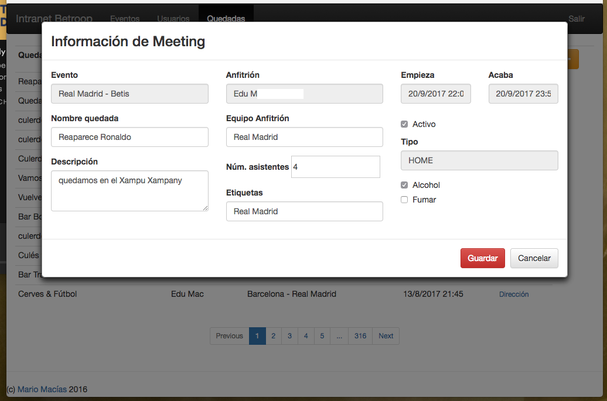

# Betroop Intranet

Intranet made from a previous, extinct personal project. It has been done
during my spare time (mainly, train trips), so you will notice it is not a 100%
accurate/well tested project.

Used technologies:

* Kotlin for the backend
* Apache Shiro for the authentication
* Apache Tiles 3 for the server-side rendering 
* Javascript/AngularJS for the frontend and client-side rendering
* Spring Boot as the glue for everything 

## Screenshots

### Login page

### List/edit of future sportive events

### Users list

### User details

### Meetings list

### Meeting information

### Meeting location

